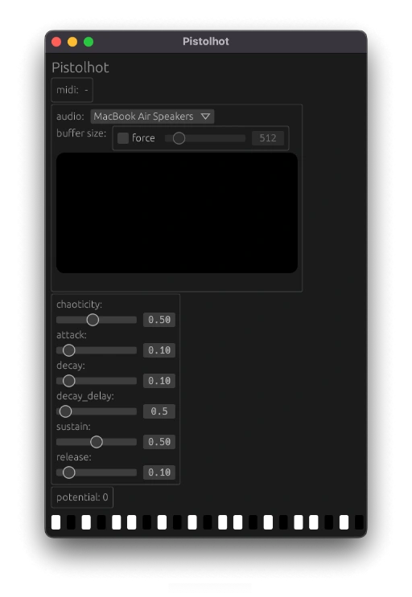

# Pistolhot

Work in progress double pendulum synth



## To build and run natively:
```
cargo run --release -p pistolhot-standalone
```

## To build vst
```
cd vst
# on windows
cargo build
# on mac
cargo make mac_bundle_debug
```
Add the `vst` directory to your vst search path.

## To build wasm version for web.
```
cargo install cargo-make
cd wasm

# option 1
cargo make build_web_release
# option 2
cargo make watch

# in separate shell
cargo make serve
```
 
The open a browser (with webmidi support) and point it to http://localhost:8000
